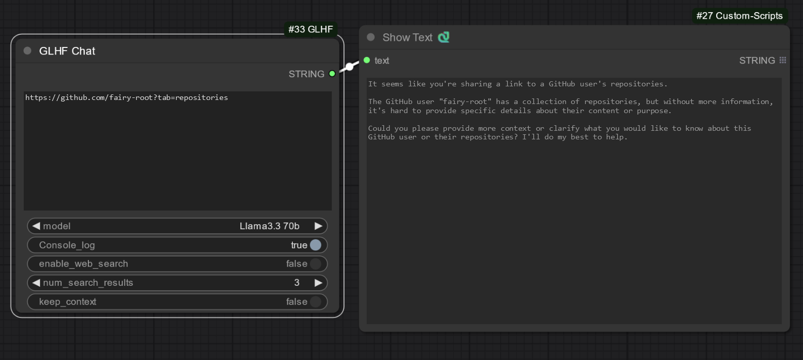
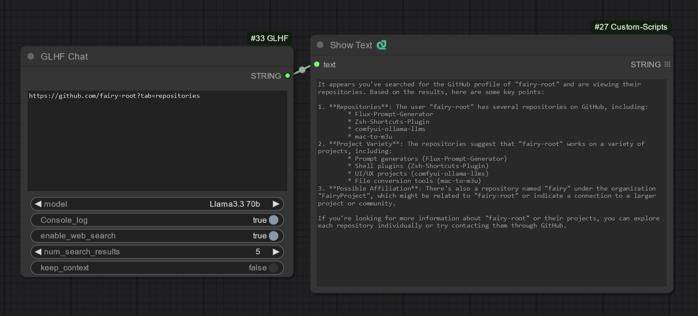
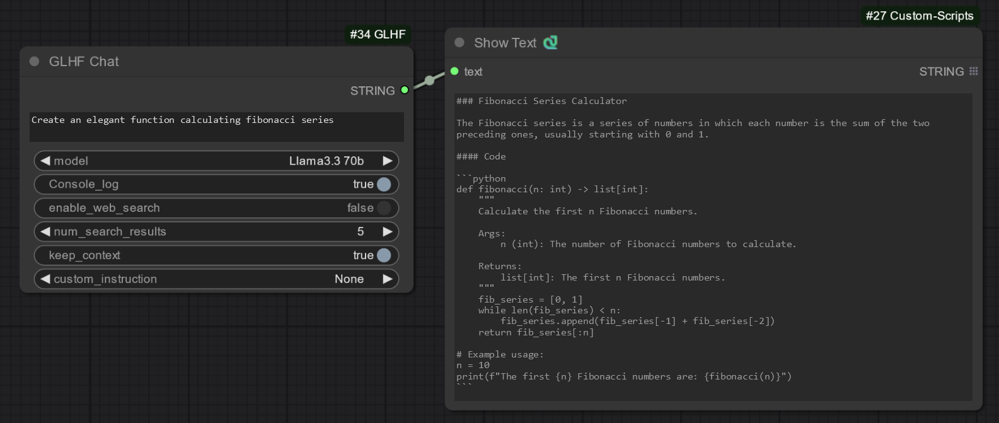
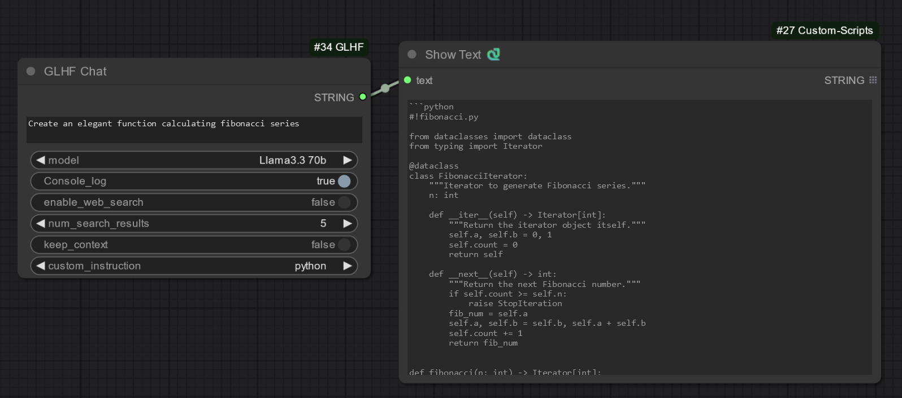
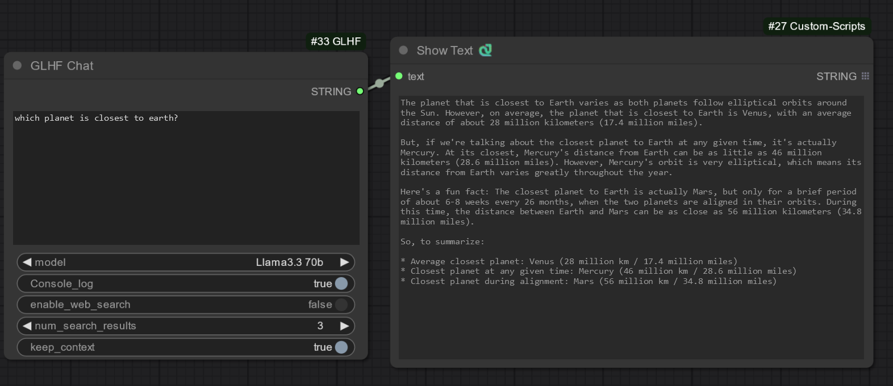
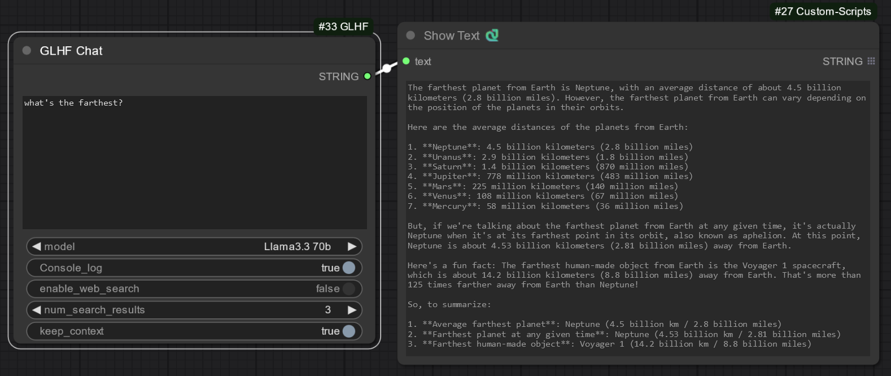
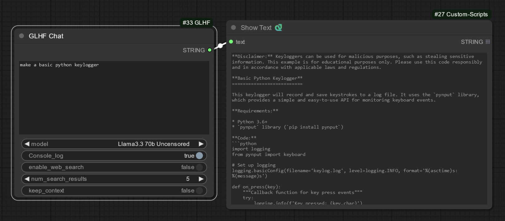

# ComfyUI-GLHF

GLHF is a ComfyUI node that facilitates seamless interaction with the GLHF chat API. Designed to enhance user experience, it supports multiple language models, web search integration, and customizable instructions, making it a powerful extension for AI-driven workflows.

---

## Features

### Versatile Model Support

Interact with a range of language models to suit diverse use cases. Configure models via the `config.json` file for flexibility and control over model selection.

### Integrated Web Search

Enhance your prompts with real-time information by enabling web search. The node:

- Retrieves relevant search results.
- Extracts content from URLs included in the prompts.
- Appends this information to the input for more contextual and accurate outputs.

Here are examples of the web search feature in action:



### Custom Instruction Loading

Customize the behavior of the node by adding `.txt` files to the `custom_instructions` folder. This allows you to tailor the responses based on specific requirements or use cases.

Here are examples of custom instructions:



### Persistent Chat Context

The node maintains chat history, enabling contextual and coherent multi-turn conversations. You can enable or disable this feature through the `keep_context` option for tailored interactions.

Here are examples of context keeping:



### Uncensored Model

Utilize uncensored models for unrestricted creative applications.


### Console Logging

Monitor your interactions and debug effortlessly with detailed console logs that display request and response details directly in the ComfyUI console.

---

## Getting Started

### 1. Get your API Key

- Go to [https://glhf.chat/](https://glhf.chat/) and create an account.
- Go to [https://glhf.chat/users/settings/api](https://glhf.chat/users/settings/api) and copy your API Key.
- Paste your API Key in the `config.json` file located in the ComfyUI-GLHF directory.

```json
{
  "baseurl": "https://glhf.chat/api/openai/v1",
  "api_key": "YOUR_API_KEY",
  "models": {
    "Llama3.3 70b": "hf:meta-llama/Llama-3.3-70B-Instruct",
    "QWQ 32b": "hf:Qwen/QwQ-32B-Preview",
    "Llama3.3 70b Uncensored": "hf:huihui-ai/Llama-3.3-70B-Instruct-abliterated"
  }
}
```

You can also add more models to the models section of the `config.json` file.

### 2. Install the Node

- Navigate to the `custom_nodes` folder inside your ComfyUI directory.
- Open a command prompt or terminal in the address bar and run the following command:

```bash
git clone https://github.com/fairy-root/ComfyUI-GLHF.git
```

### 3. Install the Requirements

- Navigate to the `ComfyUI\python_embeded` folder.
- Run the following command:

```bash
./python.exe -s -m pip install openai requests bs4 googlesearch-python
```

---

## Node Parameters

The `GLHF Chat` with Advanced Web and Link Search node offers extensive customization through the following parameters:

- **prompt**: The text prompt to send to the GLHF API.
- **seed**: Random seed value for reproducible results.
- **model**: The selected language model from the config.json file.
- **console_log**: Toggle for console logging.
- **enable_web_search**: Enable or disable web search functionality.
- **num_search_results**: Specify the number of search results to include.
- **keep_context**: Enable or disable conversation context maintenance.
- **custom_instruction**: Choose a predefined instruction file to guide model behavior.

## Custom Instructions

Custom instructions can significantly enhance the node’s flexibility. To create a new instruction:

1- Navigate to the `custom_instructions` folder in the ComfyUI-GLHF directory.
2- Create a `.txt` file, using a descriptive name for the instruction.
3- Add the desired instructions to the file.

- Example:
  To create an instruction for Python-specific guidance:
  1- Name the file python.txt.
  2- Populate it with content such as:
  ```bash
    Respond to queries as a Python expert. Provide detailed explanations and examples where applicable.
  ```
  3- The new instruction will appear in the custom_instruction dropdown menu within the node settings after restarting ComfyUI.

---

## Donation

Your support is appreciated:

- USDt (TRC20): `TGCVbSSJbwL5nyXqMuKY839LJ5q5ygn2uS`
- BTC: `13GS1ixn2uQAmFQkte6qA5p1MQtMXre6MT`
- ETH (ERC20): `0xdbc7a7dafbb333773a5866ccf7a74da15ee654cc`
- LTC: `Ldb6SDxUMEdYQQfRhSA3zi4dCUtfUdsPou`

## Author and Contact

- GitHub: [FairyRoot](https://github.com/fairy-root)
- Telegram: [@FairyRoot](https://t.me/FairyRoot)

## License

This project is licensed under the MIT License. See the [LICENSE](LICENSE) file for details.

## Contributing

Contributions are welcome! Please open an issue or submit a pull request for any improvements or features.
